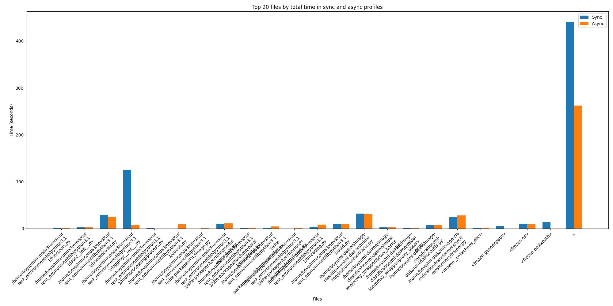
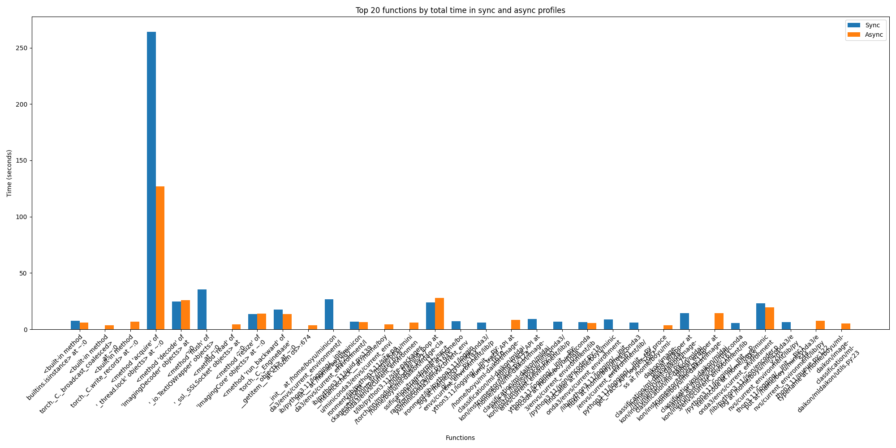

# Improvement on Logging
1. Create separate threads for each logger in each process (pid)
2. Realize asynchronous logging:   
Record trace in a buffer. If the buffer size attains a certain length (currently set to 10000), the corresponding logger will log into file once. The aim is to avoid frequently switching between logging threads and pipeline threads to decrease large overhead caused by <method 'acquire' of '_thread.lock' objects>.

NOTE: Since the encoding part is not accomplished yet, we need to add the following code manually to the instrumented pipeline after the ```main()``` function:  
```python
if __name__ == '__main__':
    main()
    from mldaikon.instrumentor.tracer import get_dicts
    trace_API_loggers, trace_VAR_loggers = get_dicts()

    for log_queue, _, _ in trace_API_loggers.values():
        log_queue.join()

    for log_queue, _, _ in trace_API_loggers.values():
        log_queue.put(None)

    for _, log_thread, _ in trace_API_loggers.values():
        log_thread.join()

    for log_queue, _, _ in trace_VAR_loggers.values():
        log_queue.join()

    for log_queue, _, _ in trace_VAR_loggers.values():
        log_queue.put(None)

    for _, log_thread, _ in trace_VAR_loggers.values():
        log_thread.join()
```

# Evaluate new logging on image-classification pipeline (7 epochs)
## Total runtime comparison
Total time for sync profile: 741.49 seconds
Total time for async profile: 436.29 seconds
## Files runtime comparison

## Function calls runtime comparison



# ML-DAIKON
[](https://github.com/OrderLab/ml-daikon/actions/workflows/pre-commit-checks.yml)

[](https://github.com/OrderLab/ml-daikon/actions/workflows/bench-instr-e2e.yml)

Instrumentor Performance Benchmark Results: http://orderlab.io/ml-daikon/dev/bench/

## Instrumentator Usage
ML-Daikon performs automatic instrumentation of programs and supports out-of-tree execution. To use the instrumentor, please install mldaikon as a pip package in the desired python environment where the example pipeline should be run in.

To install the instrumentor:
```shell
git clone git@github.com:OrderLab/ml-daikon.git
cd ml-daikon
pip3 install -e .
```

A typical instrumentor invocation looks like
```bash
python3 -m mldaikon.collect_trace \
  -p <path to your python script> \
  -s <optional path to sh script that invokes the python script> \
  -t [names of the module to be instrumented, e.g. torch, megatron] \ # `torch` is the default value here so you probably don't need to set it
  --scan_proxy_in_args \ # dynamic analysis for APIContainRelation in 84911, keep it on
  --allow_disable_dump \ # skip instrumentation for functions in modules specified in config.WRAP_WITHOUT_DUMP, keep it on for instrumentor overhead, inform @Essoz if you need those functions for invariant inference
  -d # enabling debug logging, if you are not debugging the trace collector, you probably don't need it
```

The instrumentor will dump the collected trace to the folder where you invoked the command. There should be one trace per thread and the names of trace files follow the pattern:
```bash
_ml_daikon_<pyscript-file-name>_mldaikon_trace_API_<time-of-instrumentor-invocation>_<process-id>_<thread-id>.log
```
After execution completion, you can also look at `program_output.txt` for the stdout and stderr of the pipeline being executed.

## Infer Engine Usage

```bash
python3 -m mldaikon.infer_engine \
  -t <path to your trace files> \
  -d \ # enable debug logging 
  -o invariant.json \ # name of the file to dump the inferred invariants to
```

There are two other arguments that you might need.
```bash
--disable_precond_sampling \ # by default we enable sampling of examples to be used in precondition inference when the number of examples exceeds 10000. Sampling might cause us to lose information and you can disable this behavior by setting this flag.
--precond_sampling_threshold \ # the default threshold to sample examples is 10000, change this if you need to
```