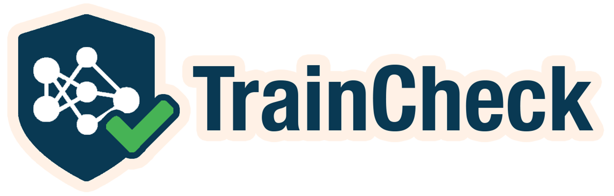
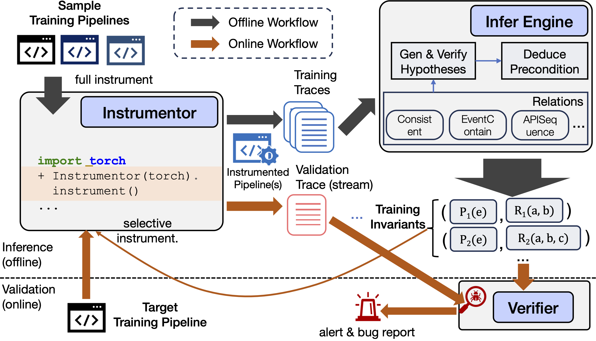

<picture>
  
</picture>
<h1>Silent Error Detection for Deep Learning Training</h1>

TrainCheck is a lightweight, extensible tool for runtime monitoring of “silent” bugs in deep‑learning training pipelines. Instead of waiting for a crash or a bad model, TrainCheck:
1. **Automatically instruments** your existing training scripts (e.g., from [pytorch/examples](https://github.com/pytorch/examples) or [huggingface/transformers/examples](https://github.com/huggingface/transformers/tree/main/examples)), inserting tracing hooks with minimal code changes.
2. **Learns precise invariants**–precise properties that should hold during training across API calls and model updates-by analyzing executions of known-good runs.
3. **Catches silent issues early**–by checking invariants on new or modified training jobs, alerting you immediately if something didn't happen as expected (e.g., model weight inconsistency, mixed precision not applied successfully, unexpected tensor shapes). On violation, TrainCheck flags the point of divergence—so users can diagnose silent issues before they derail your model.

Under the hood, TrainCheck decomposes into three CLI tools:
- **Instrumentor** (`traincheck-collect`)
  Wraps target training programs with lightweight tracing logic. It produces an instrumented version of the target program that logs API calls and model states without altering training semantics.
- **Inference Engine** (`traincheck-infer`)
  Consumes one or more trace logs from successful runs to infer low‑level invariants.
- **Checker** (`traincheck-check`)
  Runs alongside or after new training jobs to verify that each recorded event satisfies the inferred invariants.

## Status

TrainCheck is under active development. Features may be incomplete and the documentation is evolving—if you give it a try, please join our 💬 [Discord server](https://discord.gg/VwxpJDvB) or file a GitHub issue for support. Currently, the **Checker** operates in a semi‑online mode: you invoke it against the live, growing trace output to catch silent bugs as they appear. Fully automatic monitoring is on the roadmap, and we welcome feedback and contributions from early adopters.

## Try TrainCheck

1. **Install**  
   Follow the [Installation Guide](./docs/installation-guide.md) to get TrainCheck set up on your machine.

2. **Explore**  
   Work through our "[5‑Minute Experience with TrainCheck](./docs/5-min-tutorial.md)" tutorial. You’ll learn how to:
   - Instrument a training script and collect a trace  
   - Automatically infer low‑level invariants  
   - Run the Checker in semi‑online mode to uncover silent bugs

## Documentation
Please visit [TrainCheck Technical Doc](./docs/technical-doc.md).

🕵️‍♀️ OSDI AE members, please see [TrainCheck AE Guide](./docs/ae.md).
