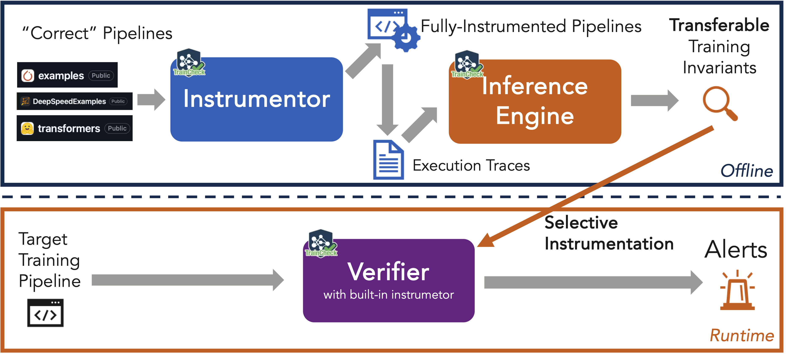

---
hide:
  - navigation
  - toc
---

<div class="hero" markdown="1">
  
  <p><strong>Invariant Checking & Observability for AI Training</strong></p>
  <p>Stop flying blind. Validate training dynamics, catch silent errors, and debug with confidence automatically.</p>
  
  [Get Started](installation-guide.md){ .md-button .md-button--primary }
  [5-Min Tutorial](5-min-tutorial.md){ .md-button }
  [View on GitHub](https://github.com/OrderLab/traincheck){ .md-button }
</div>

<div class="feature-grid">

<div class="feature-item">
<h3>✅ Continuous Invariant Checking</h3>
<p>TrainCheck validates the "physics" of your training process in real-time. It ensures your model adheres to learned invariants (such as gradient norms, tensor shapes, and update magnitudes) effectively catching silent corruption before it wastes GPU hours.</p>
</div>

<div class="feature-item">
<h3>🚀 Holistic Observability</h3>
<p>Traditional tools only show you <em>if</em> your model crashed. TrainCheck shows you <em>why</em> it's degrading, analyzing internal state dynamics that loss curves miss.</p>
</div>

<div class="feature-item">
<h3>🧠 Zero-Config Validation</h3>
<p>No manual tests required. TrainCheck automatically learns the invariants of your specific model from healthy runs and flags deviations instantly.</p>
</div>

<div class="feature-item">
<h3>⚡ Universal Compatibility</h3>
<p>Drop-in support for PyTorch, Hugging Face, and industry-class workloads using DeepSpeed/Megatron and more.</p>
</div>

</div>

---

### How It Works

1. **Instrument**: We wrap your training loop with lightweight probes. No code changes needed.
2. **Learn**: We analyze correct runs to infer *invariants* (mathematical rules of healthy training).
3. **Check**: We monitor new runs in real-time, verifying every step against learned invariants to catch silent logic bugs and hardware faults.



## 🔥 Try TrainCheck

Work through [5‑Minute Experience with TrainCheck](5-min-tutorial.md). You’ll learn how to:
   - Instrument a training script and collect a trace  
   - Automatically infer invariants  
   - Uncover silent bugs in the training script

## Documentation

- **[Installation Guide](installation-guide.md)**
- **[Usage Guide: Scenarios and Limitations](usage-guide.md)**
- **[TrainCheck Technical Doc](technical-doc.md)**
- **[TrainCheck Dev RoadMap](https://github.com/OrderLab/traincheck/blob/main/ROADMAP.md)**

## Status

TrainCheck is under active development. Please join our 💬 [Discord server](https://discord.gg/VwxpJDvB) or file a GitHub issue for support. 
We welcome feedback and contributions from early adopters.

## Contributing

We welcome and value any contributions and collaborations. Please check out [Contributing to TrainCheck](https://github.com/OrderLab/traincheck/blob/main/CONTRIBUTING.md) for how to get involved.

## License

TrainCheck is licensed under the [Apache License 2.0](https://github.com/OrderLab/traincheck/blob/main/LICENSE).

## Citation

If TrainCheck is relevant to your work, please cite our paper:
```bib
@inproceedings{TrainCheckOSDI2025,
  author = {Jiang, Yuxuan and Zhou, Ziming and Xu, Boyu and Liu, Beijie and Xu, Runhui and Huang, Peng},
  title = {Training with Confidence: Catching Silent Errors in Deep Learning Training with Automated Proactive Checks},
  booktitle = {Proceedings of the 19th USENIX Symposium on Operating Systems Design and Implementation},
  series = {OSDI '25},
  month = {July},
  year = {2025},
  address = {Boston, MA, USA},
  publisher = {USENIX Association},
}
```

## Artifact Evaluation

🕵️‍♀️ OSDI AE members, please see [TrainCheck AE Guide](ae.md).
